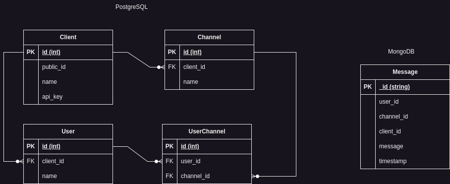

# Messaging API platform

## Description
Project chat platform as a homework for day 4, Java backend class.

### Technologies used
- Spring MVC, Spring WebFlux
- Spring WebSocket
- Spring Data JDBC with PostgreSQL, MongoDB
- Spring Cloud with Reactive Gateway
- Spring Docker compose support
- Redis

### Design
#### Modules
   - Springboot: gateway (port 8089), crm-service (port 8081), chat-service (port 8082), 
   - Java library: distributed-core
#### Database

### Note
- API endpoints can be found in [http-request.http](http-request.http) file.
- Running environment must have docker engine.
